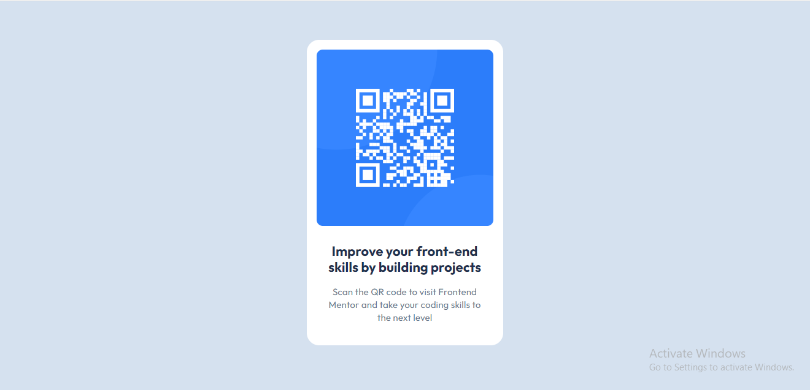

# Frontend Mentor - QR code component solution

This is a solution to the [QR code component challenge on Frontend Mentor](https://www.frontendmentor.io/challenges/qr-code-component-iux_sIO_H). Frontend Mentor challenges help you improve your coding skills by building realistic projects. 

## Table of contents

- [Overview](#overview)
  - [Screenshot](#screenshot)
  - [Links](#links)
  - [Built with](#built-with)
  - [What I learned](#what-i-learned)
  - [Useful resources](#useful-resources)
- [Author](#author)

## Overview
This prject is a simple project that demonstrates my basic knowledge f HTML and CSS. In this project I designed a simple though static QR Code as a webpage.
### Screenshot

### Links

- Solution URL: (https://github.com/Sumta4real/QR-CodeProject/)
- Live Site URL: (https://qr-code-project-2.vercel.app/)

### Built with

- Semantic HTML5 markup
- CSS custom properties
- Flexbox
- CSS Grid

### What I learned

I have mastered the flex layout principle as well as using custom fonts within my webpage and I can conveniently use it moving forward

### Useful resources

- [Center div inside body horizontallly and vertically](https://www.youtube.com/watch?v=hH1kRARxUhs) - This helped me understand how to use flexbox to center div horizontally
- [Using Custom Font](https://www.youtube.com/watch?v=iIqgW-stZmE) - This is an amazing video that helped me understand how to use google fonts within my webpage

## Author

- Website - [Sumayyah Taiwo]
- Frontend Mentor - [@Sumta4real](https://www.frontendmentor.io/profile/@Sumta4real)
- Linkedin - [Sumayyah Taiwo](https://www.linkedin.com/in/sumayyah-taiwo/)

